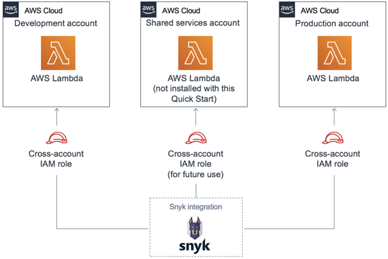
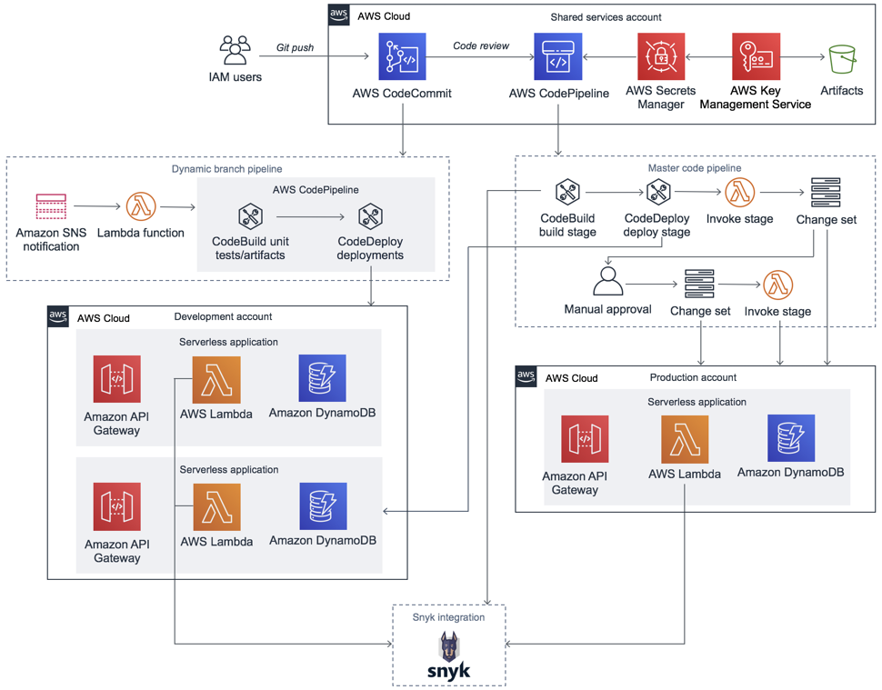

# quickstart-snyk-serverless
## Snyk Serverless CI/CD for the Enterprise on the AWS Cloud

This Quick Start enables integration between your Snyk organization and deployed AWS Lambda functions in your AWS Accounts. It allows users to secure their applications by finding, fixing, and monitoring potential vulnerabilities in open-source dependencies. It’s based on and deploys the resources in the [Serverless CI/CD Quick Start created by Trek10](https://aws.amazon.com/quickstart/architecture/serverless-cicd-for-enterprise/).

The Quick Start is automated by AWS CloudFormation templates that deploy a Snyk serverless integration in about 20 minutes in your AWS accounts.

Following AWS best practices for isolating resources, this Quick Start requires you to create three AWS subaccounts: shared services, development, and production. As Figure 1 shows, you deploy AWS Identity and Access Management (IAM) roles and policies to give your Snyk Organization ID access to the accounts. This access establishes integrations that secure your CI/CD pipelines so that you can use Snyk to perform security scans of your applications.

    

Figure 1: This Quick Start integrates Snyk with three AWS accounts

Additionally, this Quick Start deploys various AWS services and resources to create the serverless CI/CD environment, as detailed in the [Trek10 Serverless CI/CD Quick Start deployment guide](https://fwd.aws/53avp). Figure 1 shows Snyk integration with AWS Lambda. You may want to integrate additional services, depending on the workflow of your CI/CD pipeline.

### Cost and licenses

You are responsible for the cost of the AWS services used while running this Quick Start reference deployment. There is no additional cost for using the Quick Start.

Snyk, which is available in the AWS Marketplace as [Snyk: Developer-First Security](https://aws.amazon.com/marketplace/pp/B085VGM85Q?qid=1587078167615&sr=0-1&ref_=srh_res_product_title), is fulfilled as a SaaS offering. SaaS is a delivery model for software applications whereby the vendor hosts and operates the application over the internet. Customers pay to use the software without owning the underlying infrastructure. With SaaS contracts, customers pay for usage through their AWS bill.

### Architecture

Figure 2 shows the architecture of the serverless CI/CD environment after you deploy this Quick Start, along with the integration of your AWS Lambda functions into your Snyk organization.

    

Figure 2: Quick Start architecture for Snyk serverless CI/CD on AWS

For details on the resources deployed for the serverless CI/CD environment provided by Trek10, read the [Trek10 Serverless CI/CD Quick Start deployment guide](https://fwd.aws/53avp).

### Prepare your AWS account

1. Sign in to your AWS account at [https://aws.amazon.com](https://aws.amazon.com/) with an IAM user role that has the necessary permissions. 
2. Set up subaccounts for shared services, development, and production: 
    1. Open the AWS Organizations console at [https://console.aws.amazon.com/organizations/](https://console.aws.amazon.com/organizations/). Follow the instructions in the AWS documentation to [create an organization](https://docs.aws.amazon.com/organizations/latest/userguide/orgs_manage_create.html).
    2. Follow the instructions in the AWS documentation to [create three subaccounts](https://docs.aws.amazon.com/organizations/latest/userguide/orgs_manage_accounts_create.html): shared services, development, and production. If you have a large development organization, consider creating separate sets of these three subaccounts for each business unit or logical grouping of applications.
    3. Save the AWS account IDs for all three subaccounts (shared services, development, and production). You will use these in a later step. For additional information, see [Finding your AWS account ID in the AWS documentation](https://docs.aws.amazon.com/IAM/latest/UserGuide/console_account-alias.html).

### Get your Snyk Organization ID

This Quick Start requires that you have a Snyk login or subscription. If you don't have a Snyk login, open the page for the [Snyk: Developer-First Security](https://aws.amazon.com/marketplace/pp/B085VGM85Q?qid=1587078167615&sr=0-1&ref_=srh_res_product_title) in AWS Marketplace, and choose **Continue to Subscribe.** Review the terms and conditions for software usage, and choose **Accept Terms**. A confirmation page loads, and an email confirmation is sent to the account owner. For detailed subscription instructions, see the [AWS Marketplace documentation](https://aws.amazon.com/marketplace/help/200799470).

1. Sign in to your [Snyk account](https://snyk.io/). 
2. Select the **Settings** tab. Under **Organization ID**, choose **Copy**. Save this ID. You will use it in a later step.

### Enable cross-account access

#### In the development subaccount:

1. Sign in to the development subaccount as a user with IAM permission to create a CloudFormation stack and an IAM role.
2. [Deploy a Trek10 IAM role](https://fwd.aws/YrVVz).
3. [Deploy a Snyk IAM role](https://fwd.aws/d9KN5).
4. Sign out of the development subaccount.

#### In the production subaccount:

1. Sign in to the production subaccount as a user with IAM permission to create a CloudFormation stack and an IAM role. 
2. [Deploy a Trek10 IAM role](https://fwd.aws/YrVVz).
3. [Deploy a Snyk IAM role](https://fwd.aws/d9KN5).
4. Sign out of the production subaccount.

### Deploy resources
1. Sign in to the AWS shared services subaccount as a user with IAM permissions to create resources in several AWS services. We recommend using the **AdministratorAccess** managed policy.
2. [Deploy resources across the three subaccounts](https://fwd.aws/YeDwE).

To post feedback, submit feature ideas, or report bugs, use the **Issues** section of this GitHub repo.
If you'd like to submit code for this Quick Start, please review the [AWS Quick Start Contributor's Kit](https://aws-quickstart.github.io/).
